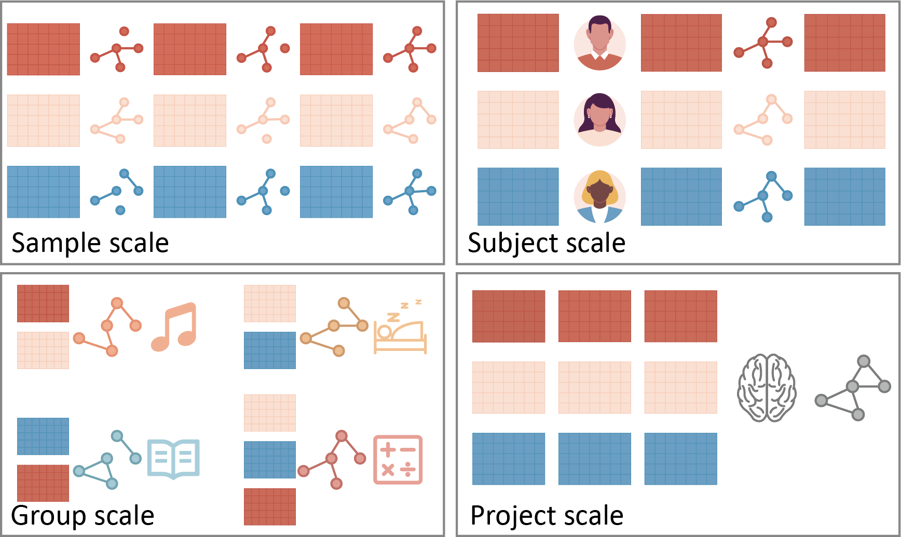
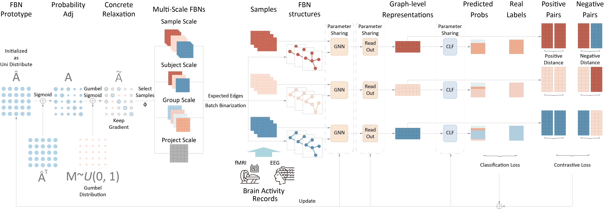

# **Offical Code for GIM submitted to ICDE 25**

## Description
**GIM** is designed to automatically learn brain network structures according to 4 distinct research scales, namely sample-scale, subject-scale, group-scale and group-scale, respectively. The description and typical scenario of these four scales are as follow:
- Sample-Scale focuses on short time segments, essential for studying dynamic neural processes (e.g. dynamic brain network configuration).
- Subject-Scale aggregates samples from the same subject (individual/participand, etc.), preserving personal variability (e.g., brain fingerprinting).
- Group-Scale identifies shared patterns between groups (categories/classes), capturing representative group-level patterns (e.g., gender, mental disease).
- Project-Scale uncovers dataset-wide patterns, providing insights that cannot be derived from individual groups alone (e.g., brain atlas, human connectome project).


Multi-scale functional brain network structure learning can be described as follow:


The framework of **GIM** is depicted as follow:



## Environment
- cuda 11.8
- pytorch == 2.3.1
- pytorch geometric == 2.5.3
- numpy == 1.26.4
- sklearn == 1.5.1

## Dataset
- [HCP]{https://www.humanconnectome.org}, [NeuroGraph]{https://anwar-said.github.io/anwarsaid/neurograph.html}
- [Cog State]{https://openneuro.org/datasets/ds004148}
- [SLIM]{https://fcon_1000.projects.nitrc.org/indi/retro/southwestuni_qiu_index.html}

## Tools for Dataset Preprocess
- [DPABI]{https://rfmri.org/DPABI}
- [EEGLab]{https://sccn.ucsd.edu/eeglab/index.php}

## Use
The model can be trained and tested by the following command
```bash
python main.py
```

The hyper parameters are set in config.py
