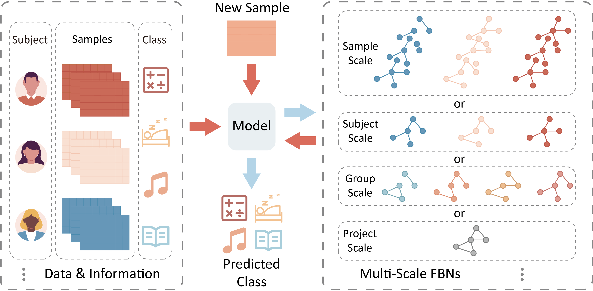

# **Offical Code for CFBNL submitted to KDD 25**

## Description
**Contrastive Functional Brain Network Learning (CFBNL)** is designed to automatically learn brain network structures according to 4 distinct research scales, namely sample-scale, subject-scale, group-scale and group-scale, respectively. The description and typical scenario of these four scales are as follow:
- Sample-Scale focuses on short time segments, essential for studying dynamic neural processes (e.g. dynamic brain network configuration).
- Subject-Scale aggregates samples from the same subject (individual/participand, etc.), preserving personal variability (e.g., brain fingerprinting).
- Group-Scale identifies shared patterns between groups (categories/classes), capturing representative group-level patterns (e.g., gender, mental disease).
- Project-Scale uncovers dataset-wide patterns, providing insights that cannot be derived from individual groups alone (e.g., brain atlas, human connectome project).


**CFBNL** learns brain networks using method derived from Graph Structure Learning (GSL) research. Related works of GSL can be found in [**Awesome GSL**]{https://github.com/GSL-Benchmark/Awesome-Graph-Structure-Learning}. According to the target scale, **CFBNL** learns brain networks as follow:
- Sample-scale: **CFBNL** learns multiple brain networks for each subject according to each sample in the dataset. Each brain network depicts a transient co-activivy of variables in the sample. The brain function of a subject could be modeled by multiple brain networks (dynamic brain network).
- Subject-scale: **CFBNL** learns brain network for each subject based on their corresponding samples in the dataset. The brain network is learned by merging information from multiple homologic samples. The brain function is modeled by a single brain network.
- Grouph-scale: **CFBNL** learns a shared brain network for all the subjects based on their corresponding samples in a group. The learned brain network reflects the common property of all the subjects in the corresponding group.
- Project-scale: **CFBNL** learns a shared brain network for all the subjects based on all of their samples in a dataset. A dataset is typically collected for a project. And researchers might be curious about the common features of all the subjects in the project.

The framework of **CFBNL** is depicted as follow:


## Brain Network Visualization on HCP Gender
To illustrate the necessity of the four-scale brain network division proposed in this paper, we have followed the reviewer’s suggestion to visualize and compare the brain networks at each scale. For the sample-scale and subject-scale, we averaged the brain network weights of male and female subjects, and then visualized the networks using the method described in the paper. To compare with the project-scale network, we further averaged the networks learned at the other three scales and visualized the result. 

From the visualizations, we can observe that the networks obtained at different scales cannot be simply transformed into each other through averaging, clearly demonstrating the necessity of our four-scale division. However, the averaged networks show a consistent distribution of high-degree and low-degree nodes across the four scales. The differences observed stem from how sample information is integrated at each scale, which affects the learned networks. The exact mechanisms behind this effect are beyond the scope of this paper and will be explored in future work. These results also indicate that our proposed **CFBNL** method is effective at modeling both the commonalities and differences in brain networks across different scales.


## Environment
- cuda 11.8
- pytorch == 2.3.1
- pytorch geometric == 2.5.3
- numpy == 1.26.4
- sklearn == 1.5.1

## Dataset
- [HCP]{https://www.humanconnectome.org}, [NeuroGraph]{https://anwar-said.github.io/anwarsaid/neurograph.html}
- [Cog State]{https://openneuro.org/datasets/ds004148}
- [SLIM]{https://fcon_1000.projects.nitrc.org/indi/retro/southwestuni_qiu_index.html}

## Tools for Dataset Preprocess
- [DPABI]{https://rfmri.org/DPABI}
- [EEGLab]{https://sccn.ucsd.edu/eeglab/index.php}

## Use
The model can be trained and tested by the following command
```bash
python main.py
```

The hyper parameters are set in config.py
